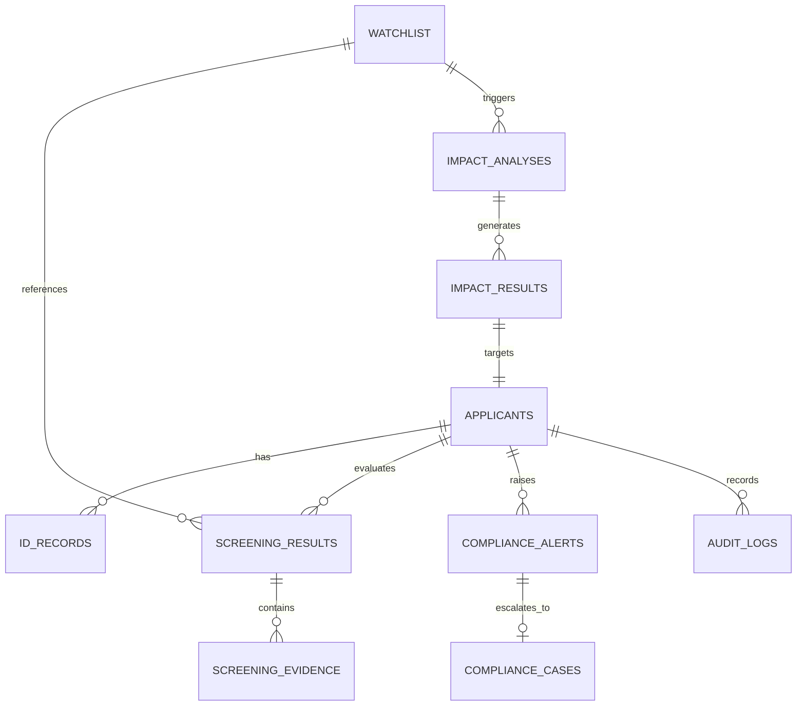

# ARCHITECTURE SPECIFICATION: KYC & AML ONBOARDING PLATFORM WITH KYC IMPACT RADAR

> **System Goal:** Enable compliance officers to process customer onboarding rapidly, enforce deterministic identity verification, calculate explainable risk ratings, conduct continuous impact analysis via **KYC Impact Radar**, manage compliance cases, and maintain an immutable, regulatory-grade audit trail.

---

## 1. Problem Decomposition & Core Value Proposition

Modern banking compliance suffers from three structural flaws:
1. **Siloed Onboarding Checks**: Customer data validation, ID verification, and watchlist screening are performed in disconnected tools, creating manual overhead and data drift.
2. **Black-Box Risk Ratings**: Generic risk scores obscure *why* a customer was flagged, leading to slow compliance reviews and false positives.
3. **Reactive Re-Screening (The Continuous Screening Problem)**: When international watchlists (OFAC, UN, EU) add or update entries, compliance teams lack tools to analyze **who is affected**, **what changed**, and **what action to take**, often resulting in delayed regulatory reporting or duplicated alert queues.

### The Solution: Integrated Compliance Engine + KYC Impact Radar
Our platform solves this by providing a unified workflow:
$$\text{Onboarding} \rightarrow \text{Consistency Check} \rightarrow \text{Watchlist Screening} \rightarrow \text{Risk Assessment} \rightarrow \text{Impact Radar} \rightarrow \text{Alerts/Cases} \rightarrow \text{Audit}$$

Every compliance query answers three core questions for the compliance officer:
1. **WHAT changed?** (e.g. *Watchlist Entry W001 "Rajesh Kumar" added for Fraud*)
2. **WHO is affected?** (e.g. *Customer C042 "Rajesh Kummar"*)
3. **WHAT should I do?** (e.g. *Recommended Action: ENHANCED_REVIEW — 97% Name Similarity, DOB & Country Match*)

---

## 2. Functional & Non-Functional Requirements

### Functional Requirements
- **Feature 1 — Applicant Onboarding**: Full CRUD with strict state transitions (`PENDING`, `APPROVED`, `REJECTED`, `REVIEW_REQUIRED`).
- **Feature 2 — Identity Consistency Engine**: Structured comparisons (Name, DOB, Address, Country-specific ID formats) with field-level match statuses and human-readable evidence.
- **Feature 3 — Screening & Risk Rating**: Multi-stage deterministic matching (Exact, Normalized, RapidFuzz token/ratio) + structured evidence collection + configurable risk threshold engine.
- **Feature 4 — Compliance Dashboard Data**: Server-side aggregation queries for status, risk breakdown, active alerts, cases, and recent audit activity.
- **Feature 5 — KYC Impact Radar (Differentiator)**: Idempotent impact analysis trigger on watchlist changes, calculating before/after risk states, generating evidence, producing recommended actions (`ENHANCED_REVIEW`, `MANUAL_REVIEW`, `NO_ACTION`), and managing cases.

### Non-Functional Requirements
- **Determinism & Explainability**: 100% of core compliance and risk decisions rely on deterministic algorithms (RapidFuzz, strict rulesets). LLMs are strictly optional for narrative generation.
- **Idempotency**: Re-running impact analysis on the same watchlist event must produce identical results without generating duplicate alerts or cases.
- **Performance & Scalability**: Modular monolith architecture with database indexes and candidate pre-filtering to support millions of customers at production scale.
- **Audit Integrity**: Append-only audit logging capturing previous state, new state, actor, timestamp, and justification.

---

## 3. Domain Model & Entity Diagram



---

## 4. Enhanced Database Schema Design (PostgreSQL / Supabase)

```sql
-- 1. APPLICANTS TABLE
CREATE TABLE applicants (
    application_id VARCHAR(50) PRIMARY KEY,
    full_name VARCHAR(255) NOT NULL,
    dob VARCHAR(20) NOT NULL,
    address TEXT NOT NULL,
    id_number VARCHAR(100) NOT NULL,
    occupation VARCHAR(100),
    annual_income NUMERIC(15, 2),
    country VARCHAR(100) NOT NULL,
    status VARCHAR(50) NOT NULL DEFAULT 'PENDING', -- PENDING, APPROVED, REJECTED, REVIEW_REQUIRED
    risk_level VARCHAR(20) NOT NULL DEFAULT 'LOW', -- LOW, MEDIUM, HIGH, CRITICAL
    created_at TIMESTAMPTZ DEFAULT CURRENT_TIMESTAMP,
    updated_at TIMESTAMPTZ DEFAULT CURRENT_TIMESTAMP
);

-- 2. ID_RECORDS TABLE
CREATE TABLE id_records (
    id_record_id VARCHAR(50) PRIMARY KEY,
    application_id VARCHAR(50) NOT NULL REFERENCES applicants(application_id) ON DELETE CASCADE,
    name_on_id VARCHAR(255) NOT NULL,
    dob_on_id VARCHAR(20) NOT NULL,
    address_on_id TEXT NOT NULL,
    created_at TIMESTAMPTZ DEFAULT CURRENT_TIMESTAMP
);

-- 3. WATCHLIST TABLE (WITH CHANGE TRACKING)
CREATE TABLE watchlist (
    watchlist_id VARCHAR(50) PRIMARY KEY,
    name VARCHAR(255) NOT NULL,
    normalized_name VARCHAR(255) NOT NULL,
    country VARCHAR(100),
    reason TEXT NOT NULL,
    status VARCHAR(20) NOT NULL DEFAULT 'ACTIVE', -- ACTIVE, INACTIVE, UPDATED
    version INT NOT NULL DEFAULT 1,
    created_at TIMESTAMPTZ DEFAULT CURRENT_TIMESTAMP,
    updated_at TIMESTAMPTZ DEFAULT CURRENT_TIMESTAMP
);

-- 4. SCREENING_RESULTS TABLE
CREATE TABLE screening_results (
    screening_id VARCHAR(50) PRIMARY KEY,
    application_id VARCHAR(50) NOT NULL REFERENCES applicants(application_id) ON DELETE CASCADE,
    watchlist_id VARCHAR(50) REFERENCES watchlist(watchlist_id) ON DELETE SET NULL,
    match_score FLOAT NOT NULL,
    match_type VARCHAR(50) NOT NULL, -- EXACT, NORMALIZED, FUZZY, NO_MATCH
    risk_level VARCHAR(20) NOT NULL,
    reason TEXT NOT NULL,
    review_status VARCHAR(50) NOT NULL DEFAULT 'PENDING',
    created_at TIMESTAMPTZ DEFAULT CURRENT_TIMESTAMP
);

-- 5. SCREENING_EVIDENCE TABLE (STRUCTURED SIGNALS)
CREATE TABLE screening_evidence (
    evidence_id VARCHAR(50) PRIMARY KEY,
    screening_id VARCHAR(50) NOT NULL REFERENCES screening_results(screening_id) ON DELETE CASCADE,
    signal VARCHAR(100) NOT NULL, -- NAME_SIMILARITY, DOB_MATCH, COUNTRY_MATCH, ADDRESS_SIMILARITY
    score_value NUMERIC(5, 2) NOT NULL,
    is_boolean_match BOOLEAN DEFAULT FALSE,
    description TEXT NOT NULL
);

-- 6. IMPACT_ANALYSES TABLE (FEATURE 5 CORE)
CREATE TABLE impact_analyses (
    analysis_id VARCHAR(50) PRIMARY KEY,
    watchlist_id VARCHAR(50) NOT NULL REFERENCES watchlist(watchlist_id) ON DELETE CASCADE,
    event_type VARCHAR(50) NOT NULL, -- WATCHLIST_ADDED, WATCHLIST_UPDATED
    customers_scanned INT NOT NULL DEFAULT 0,
    potential_matches INT NOT NULL DEFAULT 0,
    high_confidence_matches INT NOT NULL DEFAULT 0,
    review_required INT NOT NULL DEFAULT 0,
    analysis_status VARCHAR(50) NOT NULL DEFAULT 'COMPLETED', -- IN_PROGRESS, COMPLETED, FAILED
    created_at TIMESTAMPTZ DEFAULT CURRENT_TIMESTAMP
);

-- 7. IMPACT_RESULTS TABLE (BEFORE / AFTER STATE PRESERVATION)
CREATE TABLE impact_results (
    impact_result_id VARCHAR(50) PRIMARY KEY,
    analysis_id VARCHAR(50) NOT NULL REFERENCES impact_analyses(analysis_id) ON DELETE CASCADE,
    application_id VARCHAR(50) NOT NULL REFERENCES applicants(application_id) ON DELETE CASCADE,
    screening_id VARCHAR(50) REFERENCES screening_results(screening_id) ON DELETE CASCADE,
    
    -- State Preservation
    before_risk_level VARCHAR(20) NOT NULL,
    before_watchlist_status VARCHAR(50) NOT NULL,
    before_status VARCHAR(50) NOT NULL,
    
    after_risk_level VARCHAR(20) NOT NULL,
    after_watchlist_status VARCHAR(50) NOT NULL,
    after_status VARCHAR(50) NOT NULL,
    
    risk_change BOOLEAN NOT NULL DEFAULT FALSE,
    match_score FLOAT NOT NULL,
    recommended_action VARCHAR(50) NOT NULL, -- ENHANCED_REVIEW, MANUAL_REVIEW, NO_ACTION
    reason TEXT NOT NULL,
    created_at TIMESTAMPTZ DEFAULT CURRENT_TIMESTAMP
);

-- 8. COMPLIANCE_ALERTS TABLE
CREATE TABLE compliance_alerts (
    alert_id VARCHAR(50) PRIMARY KEY,
    application_id VARCHAR(50) NOT NULL REFERENCES applicants(application_id) ON DELETE CASCADE,
    screening_id VARCHAR(50) REFERENCES screening_results(screening_id) ON DELETE CASCADE,
    analysis_id VARCHAR(50) REFERENCES impact_analyses(analysis_id) ON DELETE CASCADE,
    alert_type VARCHAR(50) NOT NULL, -- NEW_APPLICATION_MATCH, WATCHLIST_POTENTIAL_MATCH
    priority VARCHAR(20) NOT NULL, -- LOW, MEDIUM, HIGH, CRITICAL
    title VARCHAR(255) NOT NULL,
    description TEXT NOT NULL,
    risk_level VARCHAR(20) NOT NULL,
    match_score FLOAT NOT NULL,
    recommended_action VARCHAR(50) NOT NULL,
    status VARCHAR(50) NOT NULL DEFAULT 'OPEN', -- OPEN, IN_REVIEW, RESOLVED
    created_at TIMESTAMPTZ DEFAULT CURRENT_TIMESTAMP,
    resolved_at TIMESTAMPTZ,
    resolved_by VARCHAR(100),
    resolution_reason TEXT
);

-- 9. COMPLIANCE_CASES TABLE
CREATE TABLE compliance_cases (
    case_id VARCHAR(50) PRIMARY KEY,
    application_id VARCHAR(50) NOT NULL REFERENCES applicants(application_id) ON DELETE CASCADE,
    alert_id VARCHAR(50) REFERENCES compliance_alerts(alert_id) ON DELETE CASCADE,
    priority VARCHAR(20) NOT NULL,
    recommended_action VARCHAR(50) NOT NULL,
    final_action VARCHAR(50), -- APPROVED, REJECTED, DISMISSED
    status VARCHAR(50) NOT NULL DEFAULT 'OPEN', -- OPEN, IN_REVIEW, RESOLVED, ESCALATED
    assigned_to VARCHAR(100),
    created_at TIMESTAMPTZ DEFAULT CURRENT_TIMESTAMP,
    resolved_at TIMESTAMPTZ,
    resolution_reason TEXT
);

-- 10. AUDIT_LOGS TABLE (APPEND-ONLY)
CREATE TABLE audit_logs (
    audit_id VARCHAR(50) PRIMARY KEY,
    application_id VARCHAR(50) REFERENCES applicants(application_id) ON DELETE CASCADE,
    action VARCHAR(100) NOT NULL,
    entity_type VARCHAR(50) NOT NULL,
    entity_id VARCHAR(50) NOT NULL,
    old_value TEXT,
    new_value TEXT,
    performed_by VARCHAR(100) NOT NULL,
    timestamp TIMESTAMPTZ DEFAULT CURRENT_TIMESTAMP,
    reason TEXT NOT NULL
);

-- INDEXES FOR PRODUCTION SCALE
CREATE INDEX idx_applicants_status_risk ON applicants(status, risk_level);
CREATE INDEX idx_watchlist_normalized ON watchlist(normalized_name);
CREATE INDEX idx_screening_app_id ON screening_results(application_id);
CREATE INDEX idx_impact_results_analysis ON impact_results(analysis_id);
CREATE INDEX idx_alerts_app_status ON compliance_alerts(application_id, status);
CREATE INDEX idx_cases_status ON compliance_cases(status);
CREATE INDEX idx_audit_app_id ON audit_logs(application_id);
```

---

## 5. KYC Impact Radar Data Flow Architecture

The primary differentiator of our platform follows a 9-stage data transformation pipeline when a watchlist entry changes:

```
[ Watchlist Event (Added / Updated) ]
                │
                ▼ (Watchlist ID, Event Type)
[ 1. Impact Analysis Trigger ] ───▶ Creates ImpactAnalysis Record (IN_PROGRESS)
                │
                ▼ (Normalized Name, Country Filter)
[ 2. Candidate Pre-Filtering ] ───▶ Fetches Active Applicants (Indexed Lookup)
                │
                ▼ (Applicant Raw Data vs Watchlist Raw Data)
[ 3. Deterministic Matching Engine ] ──▶ RapidFuzz (Token Sort, Ratio, Partial)
                │
                ▼ (Match Score, Signals: Name, DOB, Country, Address)
[ 4. Evidence Construction ] ──────▶ Saves ScreeningEvidence Records
                │
                ▼ (Score + Evidence Ruleset)
[ 5. Risk Recalculation Engine ] ──▶ Evaluates New Risk Level (LOW -> HIGH)
                │
                ▼ (Preserved Current State vs Calculated State)
[ 6. Before/After State Comparison ] ──▶ Creates ImpactResult Record
                │
                ▼ (Risk Level + Match Score)
[ 7. Recommended Action Engine ] ──▶ Generates Action (ENHANCED_REVIEW / MANUAL_REVIEW)
                │
                ▼ (If Risk Change or Potential Match)
[ 8. Alert & Case Generation ] ───▶ Creates ComplianceAlert & Optional ComplianceCase
                │
                ▼ (Action Details, Previous State, New State, Actor)
[ 9. Audit Event Generator ] ──────▶ Appends Immutable AuditLog Entry
```

### Exact Data Transferred Between Stages:
- **Stage 1 $\rightarrow$ 2**: `watchlist_id`, `event_type`, `normalized_name`.
- **Stage 2 $\rightarrow$ 3**: List of `Applicant` domain models matching pre-filter candidate criteria.
- **Stage 3 $\rightarrow$ 4**: Raw similarity metrics (`ratio_score: 97.0`, `dob_match: true`, `country_match: true`).
- **Stage 4 $\rightarrow$ 5**: List of `ScreeningEvidence` tuples (`signal`, `value`, `description`).
- **Stage 5 $\rightarrow$ 6**: Calculated `after_risk_level`, `after_status`, and `after_watchlist_status`.
- **Stage 6 $\rightarrow$ 7**: `before` object `{risk_level: "LOW", watchlist_status: "CLEAR", status: "APPROVED"}` vs `after` object `{risk_level: "HIGH", watchlist_status: "POTENTIAL_MATCH", status: "REVIEW_REQUIRED"}`.
- **Stage 7 $\rightarrow$ 8**: `recommended_action: "ENHANCED_REVIEW"`.
- **Stage 8 $\rightarrow$ 9**: Created `alert_id`, `case_id`, `application_id`, state diff payload.

---

## 6. Complete API Architecture & Contract Specification

| Method | Endpoint | Description |
|---|---|---|
| **APPLICANTS** | | |
| `GET` | `/api/applicants` | List applicants (Paginated: `skip`, `limit`, `status`, `risk_level`) |
| `POST` | `/api/applicants` | Create new applicant & run initial screening |
| `GET` | `/api/applicants/{id}` | Get applicant details with current compliance status |
| `PUT` | `/api/applicants/{id}` | Update applicant profile |
| **CONSISTENCY** | | |
| `POST` | `/api/applicants/{id}/consistency-check` | Execute field-by-field ID consistency validation |
| **SCREENING** | | |
| `POST` | `/api/applicants/{id}/screen` | Run/Re-run applicant screening against active watchlist |
| `GET` | `/api/applicants/{id}/screening-results` | Get full screening history with structured evidence |
| **WATCHLIST** | | |
| `GET` | `/api/watchlist` | List watchlist entries (Paginated) |
| `POST` | `/api/watchlist` | Create watchlist entry (Triggers Impact Radar) |
| `GET` | `/api/watchlist/{id}` | Get watchlist entry details |
| `PUT` | `/api/watchlist/{id}` | Update watchlist entry (Triggers Impact Radar) |
| **KYC IMPACT RADAR** | | |
| `POST` | `/api/watchlist/{id}/impact-analysis` | Manually trigger impact analysis for a watchlist change |
| `GET` | `/api/impact-analysis/{id}` | Get impact analysis summary metrics |
| `GET` | `/api/impact-analysis/{id}/results` | Get list of affected customers with before/after state diffs |
| **ALERTS & CASES** | | |
| `GET` | `/api/alerts` | List compliance alerts (Filter by status, priority) |
| `GET` | `/api/alerts/{id}` | Get alert details |
| `POST` | `/api/alerts/{id}/resolve` | Resolve compliance alert & record final disposition |
| `GET` | `/api/cases` | List compliance cases |
| `POST` | `/api/cases` | Create lightweight compliance case from alert |
| `GET` | `/api/cases/{id}` | Get case details |
| `POST` | `/api/cases/{id}/resolve` | Resolve compliance case (`APPROVED`, `REJECTED`, `DISMISSED`) |
| **DASHBOARD & AUDIT**| | |
| `GET` | `/api/dashboard/summary` | Server-side aggregated dashboard metrics |
| `GET` | `/api/audit-logs` | Retrieve immutable audit trail (Filter by applicant or entity) |
| `POST` | `/api/applicants/{id}/explain` | Optional AI Copilot executive risk report generation |

---

## 7. Modular Backend Service Architecture

```text
backend/
├── app/
│   ├── main.py                     # FastAPI entrypoint, middleware, CORS
│   ├── core/
│   │   ├── config.py               # BaseSettings (Thresholds, DB URLs, Secrets)
│   │   ├── database.py             # SQLAlchemy Session & Engine
│   │   └── security.py             # Auth & Tenant isolation headers
│   ├── api/
│   │   ├── v1/
│   │   │   ├── router.py           # Central Router
│   │   │   ├── applicants.py       # Feature 1 Endpoints
│   │   │   ├── consistency.py      # Feature 2 Endpoints
│   │   │   ├── screening.py        # Feature 3 Endpoints
│   │   │   ├── watchlist.py        # Watchlist CRUD
│   │   │   ├── impact_radar.py     # Feature 5 Impact Radar Endpoints
│   │   │   ├── alerts.py           # Alert Endpoints
│   │   │   ├── cases.py            # Case Management Endpoints
│   │   │   ├── dashboard.py        # Feature 4 Aggregated Metrics
│   │   │   └── audit.py            # Audit Log Endpoints
│   ├── schemas/                    # Pydantic Schemas
│   │   ├── applicant.py
│   │   ├── consistency.py
│   │   ├── screening.py
│   │   ├── impact.py
│   │   ├── alert.py
│   │   ├── case.py
│   │   └── audit.py
│   ├── models/                     # SQLAlchemy Models
│   │   ├── applicant.py
│   │   ├── id_record.py
│   │   ├── watchlist.py
│   │   ├── screening.py
│   │   ├── impact.py
│   │   ├── alert.py
│   │   ├── case.py
│   │   └── audit.py
│   ├── repositories/               # Data Access Objects (Raw DB Operations Only)
│   │   ├── applicant_repo.py
│   │   ├── watchlist_repo.py
│   │   ├── screening_repo.py
│   │   ├── impact_repo.py
│   │   ├── alert_repo.py
│   │   ├── case_repo.py
│   │   └── audit_repo.py
│   ├── matching/                   # Deterministic Matchers
│   │   ├── normalizer.py           # Unicode accent, title, & punctuation cleaner
│   │   └── fuzzy_matcher.py        # RapidFuzz Token Sort & Ratio wrapper
│   ├── services/                   # Business Logic Services
│   │   ├── applicant_service.py
│   │   ├── consistency_service.py
│   │   ├── screening_service.py
│   │   ├── risk_service.py         # Configurable Risk Matrix & Evidence Engine
│   │   ├── impact_service.py       # KYC Impact Radar Workflow Engine
│   │   ├── recommendation_engine.py# Recommended Action Generator
│   │   ├── alert_service.py
│   │   ├── case_service.py
│   │   ├── audit_service.py        # Append-only audit logger
│   │   └── llm_service.py          # Isolated Groq AI Copilot Summary Engine
├── tests/
│   ├── unit/                       # Unit tests for matchers, risk rules, and schemas
│   └── integration/                # Full workflow & API integration tests
├── HACKARENA_DECISION_LOG.md
├── ARCHITECTURE.md
└── seed_data.py                    # Real synthetic dataset ingestion script
```

---

## 8. Scalability & Production Architecture Plan

### MVP Implementation vs Production Scale

| Component | Hackathon MVP | Production Enterprise Architecture | Bottleneck Solved |
|---|---|---|---|
| **API Server** | Single FastAPI process | Stateless FastAPI Docker containers behind AWS ALB | High concurrent HTTP request throughput |
| **Impact Radar Processing** | In-process synchronous background execution | Watchlist Event $\rightarrow$ **Kafka / RabbitMQ** $\rightarrow$ **Celery / Arq Workers** | Prevents blocking HTTP requests during million-customer re-screening |
| **Candidate Pre-filtering** | Memory array scan / SQL `LIKE` query | PostgreSQL `pg_trgm` GIST index / Elasticsearch candidate retrieval | Eliminates $O(N \times M)$ cross-product string comparisons |
| **Database** | PostgreSQL / Supabase with single instance | PostgreSQL with PgBouncer connection pooler + Read Replicas | DB connection exhaustion & query latency on dashboard stats |
| **Idempotency** | Event ID hash check in `impact_analyses` table | Redis distributed locking + DB unique constraints | Prevents duplicate processing on worker retries |

---

## 9. Implementation Plan & Phases

- [ ] **Phase 1: Database Migration & Schema Expansion**: Implement expanded SQLAlchemy models (`screening_evidence`, `impact_analyses`, `impact_results`, `compliance_alerts`, `compliance_cases`).
- [ ] **Phase 2: Core Matching & Evidence Engine Refactoring**: Enhance `matching/` module with structured evidence tuples (Name, DOB, Country, Address).
- [ ] **Phase 3: Configurable Risk & Recommended Action Services**: Build `RiskService` and `RecommendationEngine` supporting `ENHANCED_REVIEW`, `MANUAL_REVIEW`, and `NO_ACTION`.
- [ ] **Phase 4: Feature 5 — KYC Impact Radar Implementation**: Build `ImpactService` executing the 9-stage impact analysis pipeline with before/after state diff preservation.
- [ ] **Phase 5: Compliance Alert & Case Management Services**: Implement `CaseService` for lightweight case creation, status tracking, and officer resolution workflows.
- [ ] **Phase 6: Comprehensive Audit Trail Refactoring**: Expand `AuditService` to log impact events, risk changes, case resolutions, and watchlist edits.
- [ ] **Phase 7: End-to-End Synthetic Demo Ingestion & Testing**: Re-run seed script and expand test suite in `tests/test_compliance_engine.py` covering all onboarding, screening, impact radar, case, and audit scenarios.
- [ ] **Phase 8: Documentation & Decision Log Update**: Update `ARCHITECTURE.md` and `HACKARENA_DECISION_LOG.md`.
